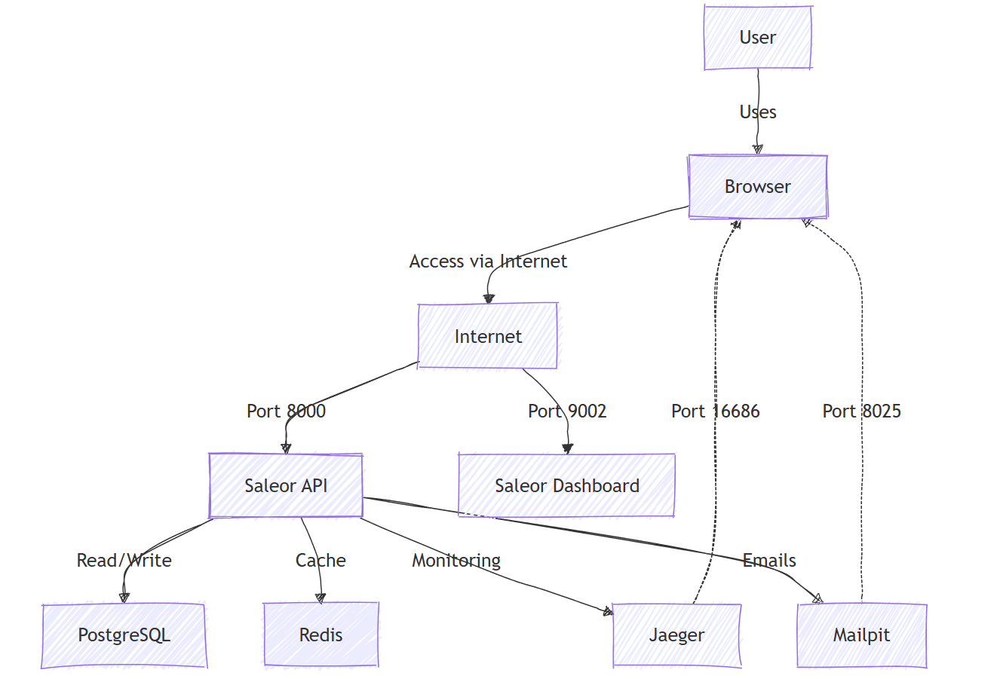

# ISEC6000-Assessment1-20908566

## Project Overview
ISEC6000-Assessment 1 is a microservices-based e-commerce application deployed using the Saleor platform. This project demonstrates modern DevOps practices such as containerization with Docker, orchestration with Kubernetes, and deployment on Google Kubernetes Engine (GKE). The focus is on securing and scaling the application to handle real-world workloads.

## Tech Stack
- **Kubernetes (GKE):** Container orchestration and management.
- **Docker:** Containerization of microservices.
- **Saleor:** Open-source, Python-based e-commerce platform with API, Dashboard, and Storefront components.
- **Google Cloud SDK:** Managing GKE and other cloud resources.
- **PostgreSQL:** Database management for persistent data storage.
- **Redis:** In-memory data caching for optimized performance.

## Architecture
The application is built on a microservices architecture, including the following components:

- **User Interface:** Users interact with the Saleor platform through a web browser, accessing the services via the internet.
- **Saleor API:** Serving as the core of the architecture, the Saleor API handles data processing and communication between various components. It operates on port 8000.
- **Database:** A PostgreSQL database is employed for persistent storage of data, ensuring data integrity and durability.
- **Caching Layer:** To enhance performance and reduce latency, a Redis caching layer is implemented. It caches frequently accessed data, improving response times.
- **Administration Interface:** The Saleor Dashboard provides an administrative interface for managing the platform's configuration, products, orders, and other aspects. It operates on port 9002.
- **Application Performance Monitoring:** Jaeger is integrated to monitor the performance of the Saleor application, identifying bottlenecks and optimizing efficiency.
- **Email Testing:** During development, Mailpit is used as an interface for testing email functionality without sending actual emails. It operates on port 8025.
Interactions and Data Flow:
- **User Interaction:** Users access the Saleor platform through a web browser, initiating requests to the Saleor API.
- **API Processing:** The Saleor API processes requests, interacting with the database for data retrieval or storage as needed.
- **Caching:** Frequently accessed data is cached in Redis to improve performance.
- **Dashboard Access:** Administrators use the Saleor Dashboard to manage the platform's configuration and data.
- **Performance Monitoring:** Jaeger collects and analyzes performance metrics, providing insights for optimization.
- **Email Testing:** During development, Mailpit is used to simulate email sending and receiving.

### Architecture Diagram

### Prerequisites
Before you start, ensure you have the following tools installed:

- [Google Cloud SDK](https://cloud.google.com/sdk/docs/install)
- [Docker](https://docs.docker.com/get-docker/)
- [kubectl](https://kubernetes.io/docs/tasks/tools/install-kubectl-linux/)
- [gke-gcloud-auth-plugin](https://cloud.google.com/kubernetes-engine/docs/how-to/cluster-access-for-kubectl#install_plugin)

## Security Considerations
- **Container Security:** All containers are run as non-root users to reduce attack surfaces.
- **Vulnerability Scanning:** Trivy has been used to scan container images for vulnerabilities. 

## Contributors
- Visal Fernando (GitHub: [Visal-a-fernando](https://github.com/Visal-a-fernando))
